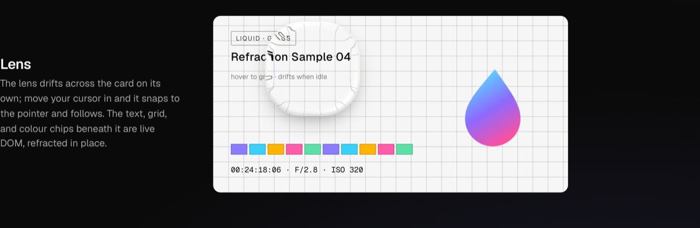
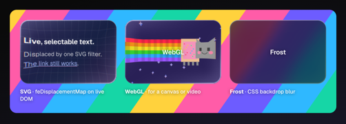
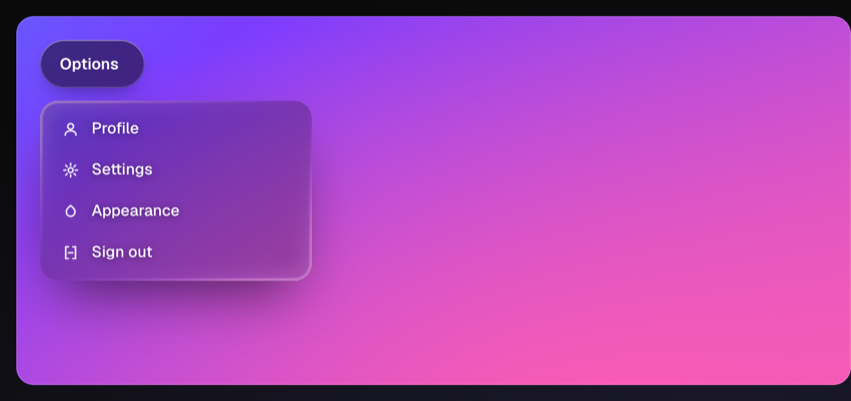
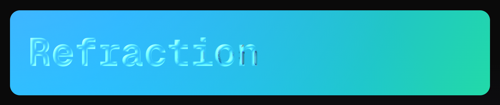
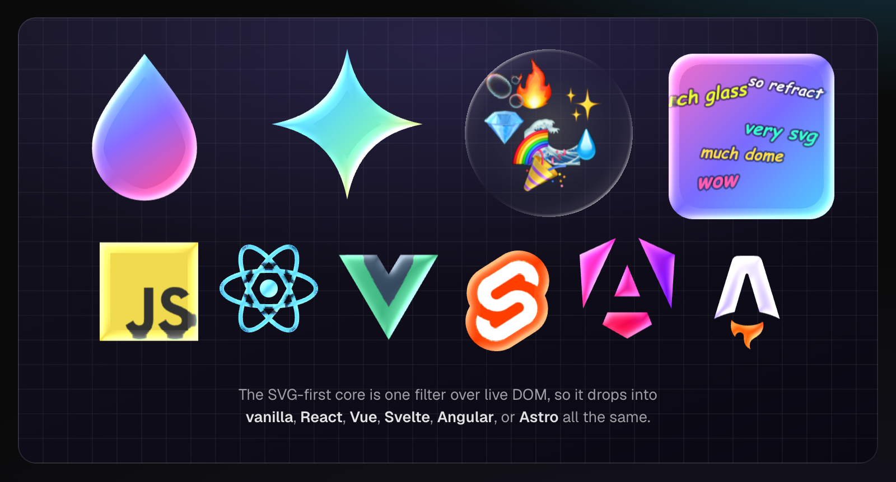

# @liquidglassjs/core

SVG-first **liquid glass** for the web. The primary renderer is an SVG
`feDisplacementMap` applied to **live DOM**, so it works in every modern
browser (Chrome, Safari, Firefox) with no flags. The content under the glass
stays selectable, scrollable, and clickable. WebGL and a procedural QR are
optional, code-split escape hatches for the two cases an SVG filter can't
cover.

<p align="center">
  <a href="https://amir-abushanab.github.io/liquid-glass-js/">
    
  </a>
</p>

<p align="center"><a href="https://amir-abushanab.github.io/liquid-glass-js/">Live showcase →</a></p>

## Why SVG-first

The popular web-glass demos use `backdrop-filter: url()`, which is
Chromium-only. This library applies the filter **on the content** instead
(`filter: url()` over the real DOM), which also works in Safari and Firefox.
WebGL is reserved for content an SVG filter can't bend: a `<canvas>` with no
live DOM, or a `<video>` (WebKit refuses to filter video).

## Install

```sh
pnpm add @liquidglassjs/core
```

`qrcode` (the only runtime dependency) is pulled in **only** by the `/qr` entry.

## Usage (vanilla)

```ts
import { mountGlass } from '@liquidglassjs/core';
import '@liquidglassjs/core/css'; // ship the .ps-glass* chrome once

const el = document.querySelector('.card');
const glass = mountGlass(el, { refract: el.querySelector('.card__content') });
// ...later
glass.dispose();
```

`mountGlass(root, opts)` builds its own chrome layers and auto-selects the
renderer (`mode: 'auto'`):

1. **`refract` element present** → SVG filter on the live DOM (the primary path; takes precedence).
2. **`source` (canvas/video/img) + WebGL2** → WebGL (lazily imported).
3. **`backdrop` (CSS background)** → SVG filter on a viewport-locked clone.
4. **otherwise** → frosted `backdrop-filter` (last resort).

<p align="center">
  <a href="https://amir-abushanab.github.io/liquid-glass-js/">
    <picture>
      <source media="(prefers-color-scheme: light)" srcset="docs/media/render-paths-light.png">
      
    </picture>
  </a>
</p>

`mode` can force `'svg' | 'webgl' | 'frost'`. WebGL degrades to frost if WebGL2
is unavailable or the renderer throws.

## Morphing surfaces

Two surfaces animate their own shape. Both reuse **one** displacement map and
touch only cheap filter attributes per frame (the `<feImage>` box and the
displacement scale). The map itself regenerates only once the size settles,
under a fresh id so Safari doesn't serve a cached one. `displScale: 0` is
clear glass, and ramping it up materializes the refraction.

A button that reshapes when its label changes:

```ts
import { mountGlassButton } from '@liquidglassjs/core';
import '@liquidglassjs/core/css';

const btn = mountGlassButton(document.querySelector('.connect'), { strength: 18 });
btn.setContent('Connecting…'); // morphs the width to fit + crossfades the label
btn.setContent('0x1A2b…9F3c'); // rapid calls interrupt and chase the newest target
```

A dropdown that materializes open (dismisses on outside-click and `Escape`):

```ts
import { mountGlassDropdown } from '@liquidglassjs/core';

const dd = mountGlassDropdown({
  trigger: root.querySelector('.trigger'),
  menu: root.querySelector('.menu'), // needs a `.gm-dd__bg` pane + `.gm-dd__item` children
});
// dd.open() / dd.close() / dd.toggle() / dd.isOpen()
```

<p align="center">
  <a href="https://amir-abushanab.github.io/liquid-glass-js/">
    
  </a>
</p>

The menu's `.gm-dd__bg` pane is the layer the filter bends. Point its
`background` at a fixed-attachment clone of the scene behind the menu and the
panel refracts the real page. The `/css` import ships the structure and the
label crossfade; sizing, colour, and the scene are yours. Both return
`dispose()`. `createGlassSurface` is exported too, for the raw resizable /
fade-able filter.

## Glass from any shape

`mountGlassText` turns letterforms into glass; `mountGlassShape` does the same
for any alpha coverage: an inline SVG mark, an ``, a `<canvas>`, or a raw
`draw` callback. The displacement map is shaped like the source's opaque pixels
and the filter clips to the target's `SourceAlpha`, so the glass traces the
artwork's silhouette.

<p align="center">
  <a href="https://amir-abushanab.github.io/liquid-glass-js/">
    
  </a>
</p>

```ts
import { mountGlassShape } from '@liquidglassjs/core';

const mark = document.querySelector('svg.logo');
const glass = mountGlassShape({ target: mark, host: mark.parentElement, source: mark });
// source can also be an HTMLImageElement / HTMLCanvasElement / url, or pass
// draw(ctx, w, h) to paint the coverage yourself. Cross-origin images need CORS.
```

<p align="center">
  <a href="https://amir-abushanab.github.io/liquid-glass-js/">
    
  </a>
</p>

Both the shape and text (and the moving lens) take two material options:
`shade` (0 to 1, a dark occlusion rim opposite the glint that reads as real-glass
depth) and `glint` (a CSS colour to tint the specular highlight). They default
to off and white respectively, so existing surfaces stay pixel-identical until
you opt in.

## Entry points (the code-split)

| Import | Ships | Notes |
|---|---|---|
| `@liquidglassjs/core` | `mountGlass` + every SVG-path renderer (`mountGlassLens`, `mountSvgRipple`, `mountGlassText`, …) | **No WebGL, no `qrcode`.** WebGL is lazy-imported at runtime only if a surface hits that path. |
| `@liquidglassjs/core/webgl` | `GlassGL` (the WebGL renderer) | Its own chunk. |
| `@liquidglassjs/qr` *(separate package)* | `mountGlassQR` + the QR internals | The only package that depends on `qrcode`; built on `@liquidglassjs/core`. |
| `@liquidglassjs/core/css` | the `.ps-glass*` styles | Import once per app. |

The split relies on the **consumer's** bundler (Vite / webpack / Rollup split by
default; esbuild needs `--splitting`). The `webgl` subpath is belt-and-suspenders
on top of the internal dynamic `import()`: a consumer who only imports `.` never
references WebGL. The Glass QR is isolated one level further, in its own package
(`@liquidglassjs/qr`), so `qrcode` never enters a core consumer's dependency tree.

## Astro

```astro
---
import LiquidGlass from '@liquidglassjs/core/astro/LiquidGlass.astro';
import LiquidGlassFont from '@liquidglassjs/core/astro/LiquidGlassFont.astro';
---
<LiquidGlass radius={20} strength={16}>
  <slot name="refract"><!-- live DOM to bend --></slot>
  <!-- default slot: overlay content -->
</LiquidGlass>
```

## Theming

The CSS is de-themed: it reads namespaced vars with sane fallbacks and assumes
nothing app-specific. Override per surface or globally:

| Var | Role | Default |
|---|---|---|
| `--glass-paper` | base "paper" behind the tint + SVG clone | `#fff` |
| `--glass-ink` | rim ink | `#000` |
| `--glass-frost-bg` | frosted-fallback background | `rgb(255 255 255 / 55%)` |
| `--glass-backdrop` | default backdrop for the SVG-clone path | consumer-supplied |

```css
.ps-glass { --glass-paper: var(--paper); --glass-ink: var(--ink); }
```

## Browser-only

Every renderer touches `document` / canvas / WebGL / SVG filters. Guard adapters
so they run client-side only (Astro `<script>` is fine; React needs `useEffect`;
never call these during SSR).

## Credits

The filter-on-content idea comes from Aave's
[_Building Glass for the Web_](https://aave.com/design/building-glass-for-the-web),
which covers the optics in depth. A few constants here (the
`erf ≈ tanh(√π·x)` approximation, the spherical-cap dome profile, the R/G/B
displacement-map layout, the fresh-filter-id Safari workaround) trace back to
that write-up.

## License

[MIT](./LICENSE) © Amir Abushanab.
